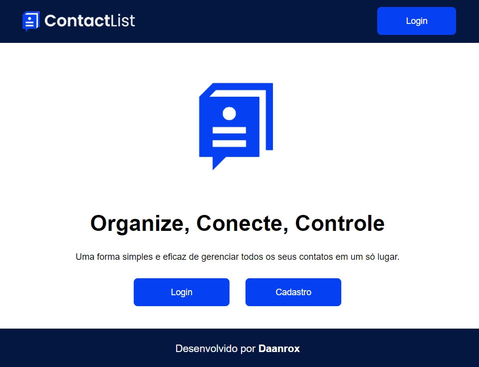

# Gerenciador de Contatos - ContactList



## Descrição
Este projeto consiste em um avançado gerenciador de contatos, desenvolvido utilizando React + Typescript como frontend e NestJS como backend. Com um foco especial na experiência do usuário e na eficiência operacional, a aplicação oferece um conjunto abrangente de funcionalidades para gerenciar contatos de maneira ágil e segura.

### Deploy
Aplicação em produção: [https://contactlist-silk.vercel.app](https://contactlist-silk.vercel.app)

## Tecnologias Utilizadas
- React
- Typescript
- Vite

## Backend em Produção
O backend está hospedado em [https://daanrox-contact-list.onrender.com/api](https://daanrox-contact-list.onrender.com/api), onde você pode acessar a documentação em Swagger UI.

## Funcionalidades
- **Autenticação Segura:** Utilização de JSON Web Token (JWT) para autenticação segura dos usuários.
- **CRUD de Contatos:** Operações completas de criação, leitura, atualização e exclusão de contatos vinculados aos usuários autenticados.
- **Exportação de Relatórios em PDF:** Capacidade de gerar relatórios detalhados dos contatos cadastrados, disponibilizando um arquivo PDF para download.
- **Validação de Dados:** Implementação de validação de formulários com React Hook Forms e Zod para garantir a integridade e precisão dos dados.
- **Feedback ao Usuário:** Utilização do pacote Toast para fornecer feedbacks visuais e notificações durante interações com o sistema.
- **Ícones Personalizados:** Integração do React Icons para fornecer uma ampla variedade de ícones personalizados e melhorar a experiência visual.
- **Modais Interativos:** Utilização do React Modal para criar modais interativos e facilitar interações específicas do usuário.
- **Carregamento Responsivo:** Implementação do React Loading para indicar efeitos visuais de carregamento durante operações assíncronas.
- **Estilos Personalizados:** Utilização do Styled Components para aplicar estilos dinâmicos e personalizados em toda a aplicação.
- **Requisições HTTP:** Integração do Axios para realizar solicitações HTTP com o backend de forma eficiente e confiável.
- **Geração de PDF:** Utilização do HTML2PDF para gerar arquivos PDF a partir do conteúdo da aplicação.


## Executando o Projeto

### Pré-requisitos
Certifique-se de ter o Node.js instalado.

### Instalação das Dependências
No terminal, execute o seguinte comando para instalar as dependências:

```bash
npm install
```
### Rodando o Projeto
Para iniciar o projeto, utilize o comando:

```bash
npm run dev
```

Isso iniciará a aplicação Vite em modo de desenvolvimento.

## Contato
Se tiver dúvidas ou precisar de mais informações, sinta-se à vontade para entrar em contato:
- Email : [contato@daanrox.com](mailto:contato@daanrox.com)
- LinkedIn: [https://www.linkedin.com/in/daanrox/](Daanrox)

--- 

Este projeto faz parte do Bootcamp de Desenvolvimento Fullstack na Kenzie Academy.
